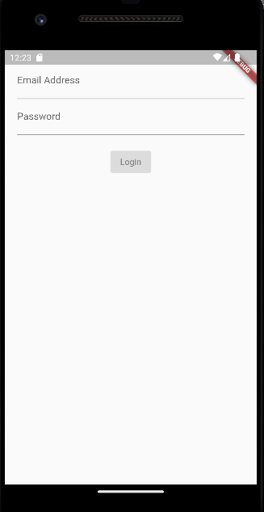
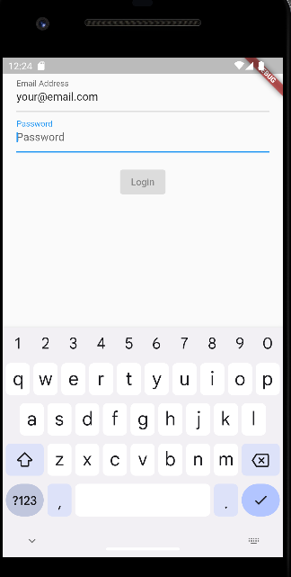
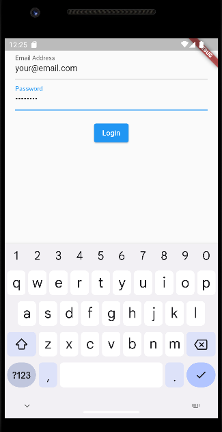

# login_bloc

Create a login application to practice Bloc and RxDart 
***

### Build widget 
```dart
class App extends StatelessWidget {
  const App({super.key});

  @override
  build(context) {
    return Provider(
      key: UniqueKey(),
      child: const MaterialApp(
        title: 'Log Me In!',
        home: Scaffold(
          body: LoginScreen(),
        ),
      ),
    );
  }
}
```
***
### login_screen page
```dart
class LoginScreen extends StatelessWidget {
  const LoginScreen({super.key});

  @override
  Widget build(context) {
    final bloc = Provider.of(context);

    return Container(
      margin: const EdgeInsets.all(20.0),
      child: Column(children: [
        emailField(bloc),
        passwordField(bloc),
        Container(
          margin: const EdgeInsets.only(top: 20.0),
        ),
        submitButton(bloc),
      ]),
    );
  }

  Widget emailField(Bloc bloc) {
    return StreamBuilder(
      stream: bloc.email,
      builder: (context, snapshot) {
        return TextField(
          onChanged: bloc.changeEmail,
          keyboardType: TextInputType.emailAddress,
          decoration: InputDecoration(
            hintText: 'you@example.com',
            labelText: 'Email Address',
            errorText: snapshot.error as String?,
          ),
        );
      },
    );
  }

  Widget passwordField(Bloc bloc) {
    return StreamBuilder(
      stream: bloc.password,
      builder: (context, snapshot) {
        return TextField(
          onChanged: bloc.changePassword,
          obscureText: true,
          decoration: InputDecoration(
            hintText: 'Password',
            labelText: 'Password',
            errorText: snapshot.error as String?,
          ),
        );
      },
    );
  }

  Widget submitButton(Bloc bloc) {
    return StreamBuilder(
      stream: bloc.submitValid,
      builder: (context, snapshot) {
        return ElevatedButton(
          onPressed: snapshot.hasData ? bloc.submit : null,
          child: const Text('Login'),
        );
      },
    );
  }
}
```
***
### Bloc class
```dart

class Bloc with Validators {
  final _email = BehaviorSubject<String>();
  final _password = BehaviorSubject<String>();

  Stream<String> get email => _email.stream.transform(validateEmail);

  Stream<String> get password => _password.stream.transform(validatePassword);

  Stream<bool> get submitValid =>
      CombineLatestStream.combine2(email, password, (email, password) => true);

  Function(String) get changeEmail => _email.sink.add;

  Function(String) get changePassword => _password.sink.add;

  submit() {
    final validEmail = _email.value;
    final validPassword = _password.value;

    print('Email is $validEmail');
    print('password is $validPassword');
  }

  dispose() {
    _email.close();
    _password.close();
  }
}
```
***
### Provider class
```dart
class Provider extends InheritedWidget {
  final bloc = Bloc();

  Provider({required Key key, required Widget child})
      : super(key: key, child: child);

  @override
  bool updateShouldNotify(_) => true;

  static Bloc of(BuildContext context) {
    return (context.dependOnInheritedWidgetOfExactType<Provider>() as Provider)
        .bloc;
  }
}
```
***
### Validators class
```dart
class Validators {
  final validateEmail =
  StreamTransformer<String, String>.fromHandlers(handleData: (email, sink) {
    if (email.contains('@')) {
      sink.add(email);
    } else {
      sink.addError('Enter a valid email');
    }
  });

  final validatePassword = StreamTransformer<String, String>.fromHandlers(
    handleData: (password, sink) {
      if (password.length >= 8) {
        sink.add(password);
      } else {
        sink.addError('Password must be at least 8 characters');
      }
    },
  );
}
```


***

***

***
